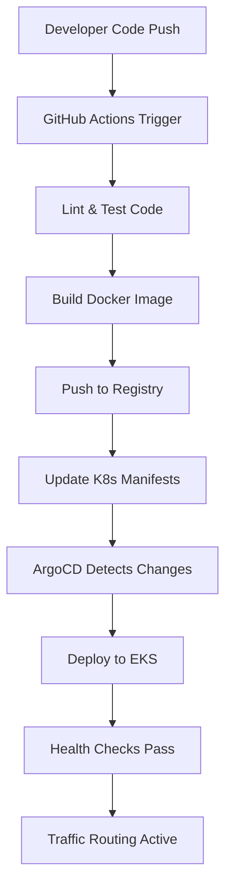
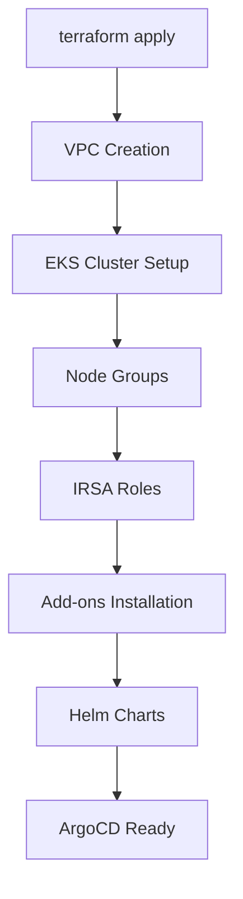
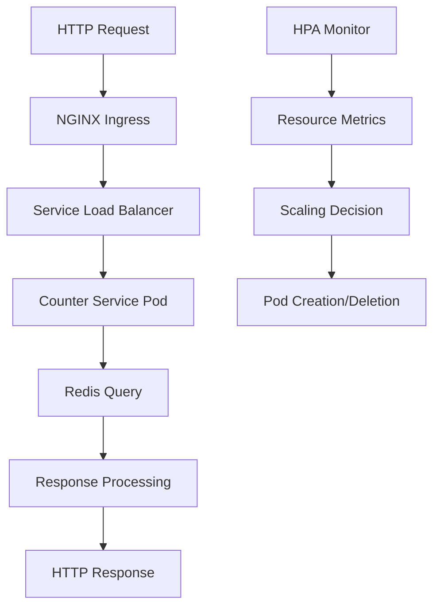
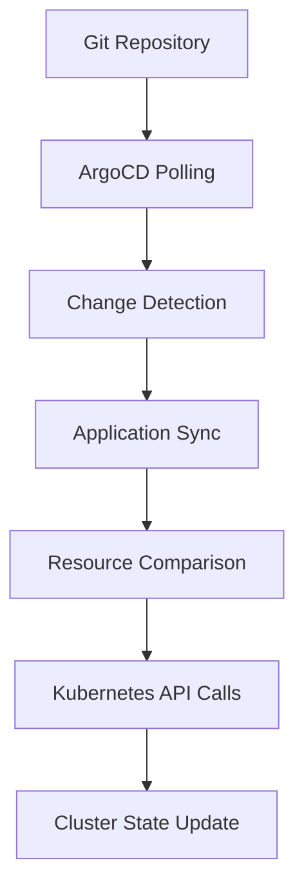
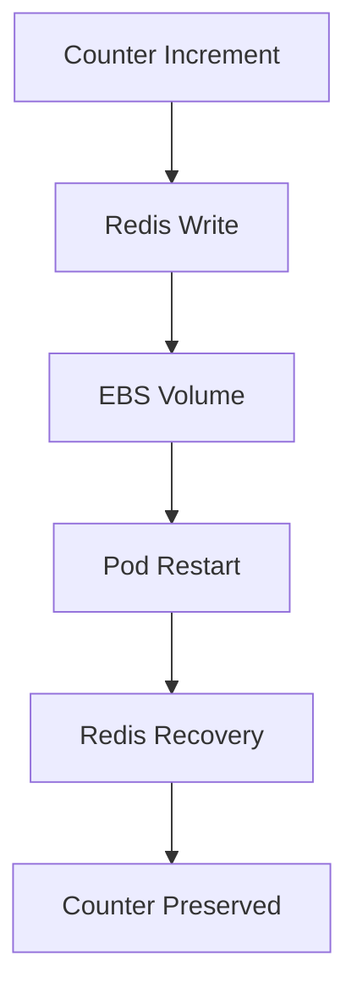

# Project Structure & Flow Documentation

## 📁 Detailed Folder Structure

```
counter-service/
├── app/                              # Application Source Code
│   ├── counter-service.py               # Main Flask application with Redis integration
│   ├── requirements.txt                 # Python dependencies (Flask, Redis, CORS)
│   └── Dockerfile                       # Multi-stage Docker build (slim Python image)
│
├── terraform/                        # Infrastructure as Code
│   ├── main.tf                         # Primary Terraform configuration
│   │   ├── VPC Module (3 AZs, NAT Gateway)
│   │   ├── EKS Cluster (v1.33, managed node groups)
│   │   ├── IRSA for EBS CSI driver
│   │   ├── Helm releases (Metrics Server, NGINX, ArgoCD)
│   │   └── Storage classes and configurations
│   ├── providers.tf                    # AWS, Kubernetes, Helm providers
│   ├── variables.tf                    # Input variables and defaults
│   └── values/argocd-values.yaml       # ArgoCD Helm chart customization
│
├── k8s/                             # Kubernetes Manifests
│   ├── namespace.yaml                  # Production namespace definition
│   ├── deployment.yaml                 # Counter-service deployment (2-10 replicas)
│   ├── service.yaml                   # ClusterIP service (port 8080→5000)
│   ├── ingress.yaml                   # NGINX ingress controller routing
│   ├── hpa.yaml                      # Horizontal Pod Autoscaler config
│   └── configmap.yaml                # Application configuration data
│
├── argocd/                         # GitOps Configuration
│   ├── projects/production.yaml       # ArgoCD project for prod environment
│   └── apps/                         # ArgoCD application definitions
│       ├── counter-service.yaml       # Counter app deployment config
│       └── redis.yaml                # Redis deployment config
│
└── .github/workflows/              # CI/CD Pipeline
    └── ci.yaml                       # GitHub Actions workflow
```

## Flow Explanations

### 1. **Development to Production Flow**



**Step-by-Step Process:**
1. **Code Push**: Developer pushes to `main` branch
2. **CI Trigger**: GitHub Actions workflow activates
3. **Quality Gates**: Flake8 linting and pytest execution
4. **Container Build**: Docker multi-stage build creates optimized image
5. **Registry Push**: Image pushed to Docker Hub with SHA and latest tags
6. **Manifest Update**: `deployment.yaml` updated with new image tag
7. **GitOps Detection**: ArgoCD polls repository every 3 minutes
8. **Deployment**: ArgoCD applies changes to EKS cluster
9. **Health Validation**: Kubernetes liveness/readiness probes verify health
10. **Traffic Switch**: Ingress controller routes traffic to healthy pods

### 2. **Infrastructure Provisioning Flow**



**Terraform Execution Order:**
1. **VPC Module**: Creates networking foundation (subnets, NAT, IGW)
2. **EKS Cluster**: Provisions managed Kubernetes control plane
3. **Node Groups**: Deploys worker nodes with auto-scaling groups
4. **IRSA Setup**: Creates IAM roles for service accounts (EBS CSI)
5. **EKS Add-ons**: Installs CoreDNS, VPC-CNI, EBS CSI driver
6. **Helm Releases**: Deploys Metrics Server, NGINX Ingress, ArgoCD
7. **Storage Classes**: Configures GP3 encrypted storage as default

### 3. **Application Runtime Flow**



**Request Processing:**
1. **Ingress**: NGINX receives external HTTP requests
2. **Service**: ClusterIP service load-balances across healthy pods
3. **Application**: Flask app processes GET/POST requests
4. **Redis**: Persistent storage for counter state
5. **Response**: JSON response with current counter value

**Auto-scaling Process:**
1. **Metrics Collection**: HPA monitors CPU/memory usage
2. **Threshold Evaluation**: Compares against 70% CPU, 80% memory targets
3. **Scaling Decision**: Calculates required replica count (2-10 range)
4. **Pod Management**: Kubernetes creates/destroys pods as needed

### 4. **GitOps Synchronization Flow**



**ArgoCD Operations:**
1. **Repository Monitoring**: Polls Git repository every 3 minutes
2. **Drift Detection**: Compares desired state (Git) vs actual (cluster)
3. **Sync Execution**: Applies differences to Kubernetes cluster
4. **Health Assessment**: Monitors application and resource health
5. **Rollback Capability**: Can revert to previous known-good state

### 5. **Data Persistence Flow**



**Persistence Strategy:**
1. **Application State**: Counter value stored in Redis
2. **Storage Backend**: Redis data persisted to EBS volumes
3. **Volume Management**: EBS CSI driver handles dynamic provisioning
4. **Restart Resilience**: Pod restarts don't affect counter state
5. **Backup Strategy**: EBS snapshots available for disaster recovery

## Key Design Decisions

### **Scalability**
- **HPA Configuration**: CPU and memory-based scaling (2-10 replicas)
- **Node Group Auto-scaling**: Infrastructure scales with demand
- **Stateless Application**: Counter state externalized to Redis

### **Reliability**
- **Multi-AZ Deployment**: Infrastructure spans availability zones
- **Health Checks**: Liveness and readiness probes prevent traffic to unhealthy pods
- **Graceful Degradation**: Application continues operating during Redis issues

### **Security**
- **IRSA Integration**: Secure AWS resource access without credentials
- **Network Isolation**: Kubernetes network policies and security groups
- **Container Security**: Non-root user, minimal base image

### **Operational Excellence**
- **Infrastructure as Code**: Complete environment reproducibility
- **GitOps Practices**: Declarative configuration management
- **Observability**: Structured logging, metrics endpoints, health checks